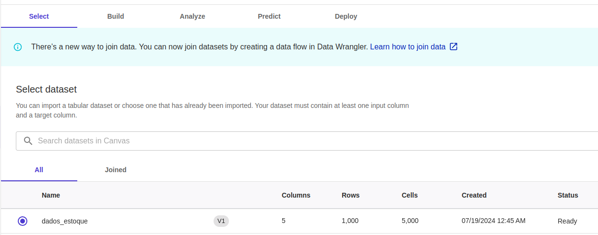
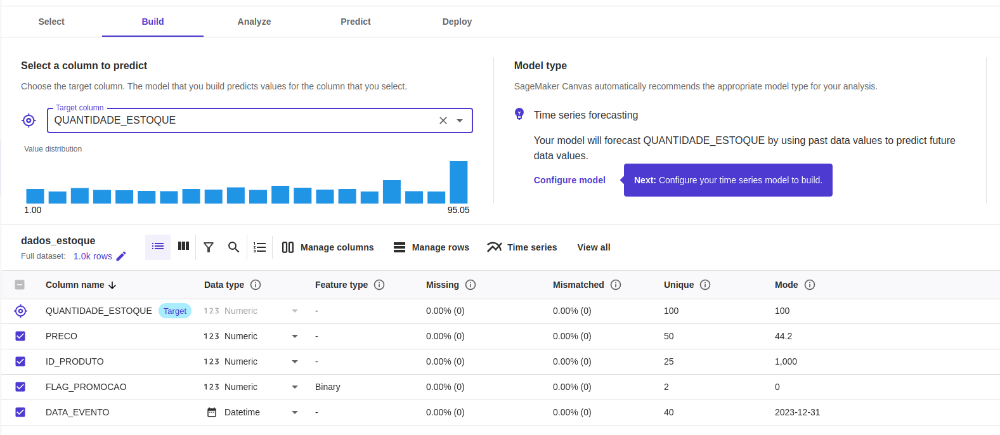
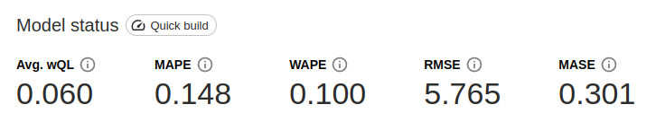
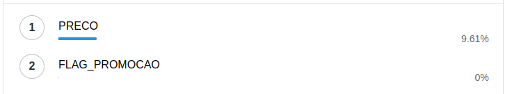

# 📊 Previsão de Estoque Inteligente na AWS com [SageMaker Canvas](https://aws.amazon.com/pt/sagemaker/canvas/)

## 🚀 Passo a Passo

### 1. Selecionar Dataset

O dataset utilizado está na pasta datasets e foi disponibilizado pela DIO.

### 2. Construir/Treinar

O target foi definido como a quantidade do produto em estoque e o modelo foi treinado utilizando quick build.

### 3. Analisar

As métricas ficaram levemente altas, visto que o quanto mais próximo a zero melhor.
Também podemos notar que com base no modelo treinado o fato do produto estar ou não em promoção não afetou a demanda.

Também podemos notar que com base no modelo treinado o fato do produto estar ou não em promoção não afetou a demanda.

### 4. Prever

As previsões se mostraram em linha com o esperado produtos com menor preço tiveram uma previsão de maior alta, não importando se está ou não em promoção.
